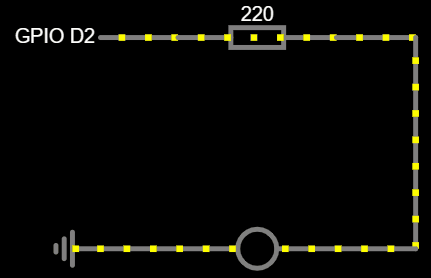
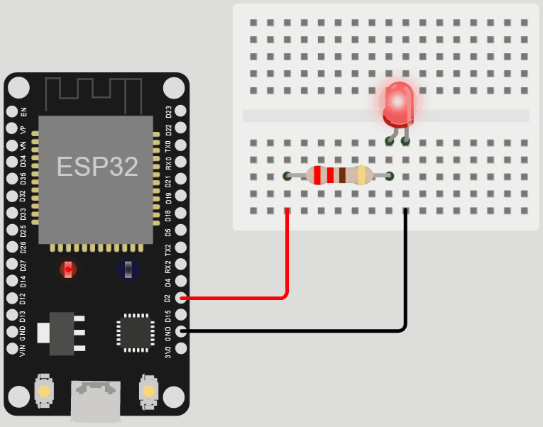

O projeto "Blink" é um dos mais comuns para iniciantes em eletrônica. Ele consiste em um circuito simples que pisca um LED com um intervalo de tempo definido.

# Circuito Blink

1. Conecte um resistor de 220 ohms à fonte de alimentação, nesse caso, o pino 2 do ESP
2. Conecte a perna positiva do LED (ânodo) ao resistor, neste caso, o pino 2 do ESP
3. Conecte a perna negativa do LED (cátodo) à contexão de terra (GND)

Quando a GPIO 2 do ESP estiver em nível lógico alto (ligada), o LED acenderá. Quando a GPIO 2 estiver em nível lógico baixo (desligada), o LED apagará.

    </img>
    </img>

[Clique aqui para abrir a simulação](https://wokwi.com/projects/358939452081276929)
