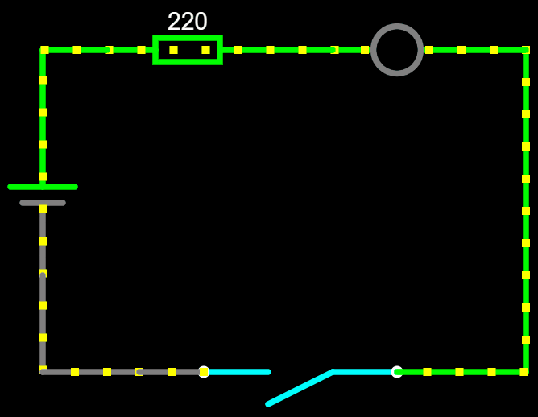
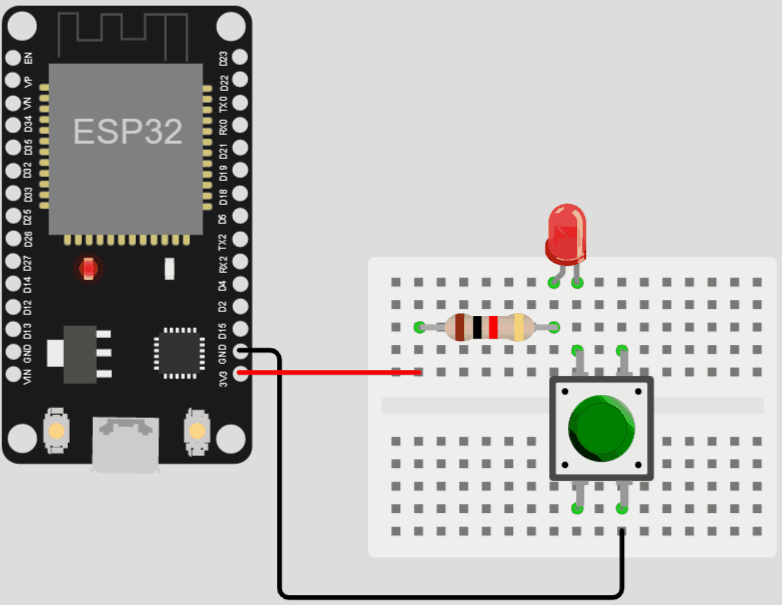

# Funcionamento de um pushbutton

Um pushbutton, ou botão de pressão, é um dispositivo eletrônico que é acionado quando pressionado e desacionado quando solto. Ele é comumente utilizado em circuitos eletrônicos para ativar ou desativar funções, tais como ligar ou desligar um aparelho eletrônico.

O funcionamento básico de um pushbutton se dá através de um contato elétrico, que é fechado quando o botão é pressionado e aberto quando é solto. Esse contato elétrico pode ser do tipo normalmente aberto (NA) ou normalmente fechado (NF).

No contato NA, o circuito está aberto quando o botão não está pressionado, e é fechado quando ele é pressionado. Já no contato NF, o circuito está fechado quando o botão não está pressionado, e é aberto quando ele é pressionado.

Os pushbuttons podem ser utilizados em diversos tipos de circuitos eletrônicos, tais como circuitos de controle de motores, circuitos de iluminação e circuitos de segurança. É importante escolher o tipo de pushbutton adequado para o circuito em questão, levando em consideração as especificações técnicas do dispositivo.

Em resumo, o pushbutton é um componente eletrônico simples, mas muito útil, que permite ativar ou desativar funções em circuitos eletrônicos. Seu funcionamento básico se dá através de um contato elétrico, que é acionado quando o botão é pressionado e desacionado quando é solto.

# Ligar um led com um botão
1. Conecte um resistor de 220 ohms à fonte de alimentação, nesse caso, o pino de 3,3V do ESP
2. Conecte a perna positiva do LED (ânodo) ao resistor.
3. Conecte a perna negativa do LED (cátodo) a uma das pernas do botão.
4. Conecte a outra perna do botão à conexão de terra (GND)..

Quando o botão é pressionado, ele completa o circuito e permite que a corrente flua através do LED, ligando-o. Quando o botão é liberado, o circuito é interrompido e o LED desliga.

É crucial usar o resistor apropriado para limitar a corrente que flui através do LED. Colocá-lo em série com o LED e a fonte de alimentação limitará a corrente para um nível seguro para o LED.

Lembre-se de verificar suas conexões e garantir que a polaridade do LED esteja correta. Inverter a polaridade pode danificar o LED e impedir que ele ligue.

    </img>
    </img>

[Clique aqui para abrir a simulação](https://wokwi.com/projects/358939441632215041)

Leia mais:
- https://components101.com/switches/push-button
- https://docs.wokwi.com/parts/wokwi-pushbutton
