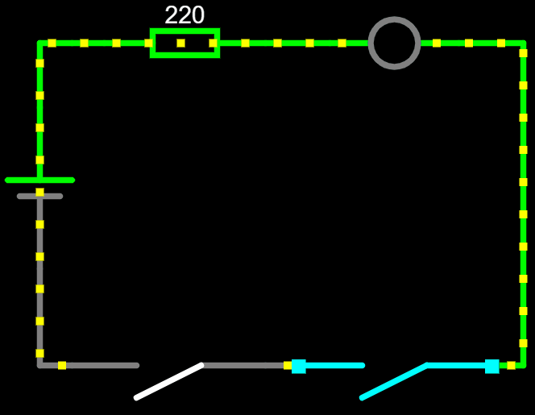
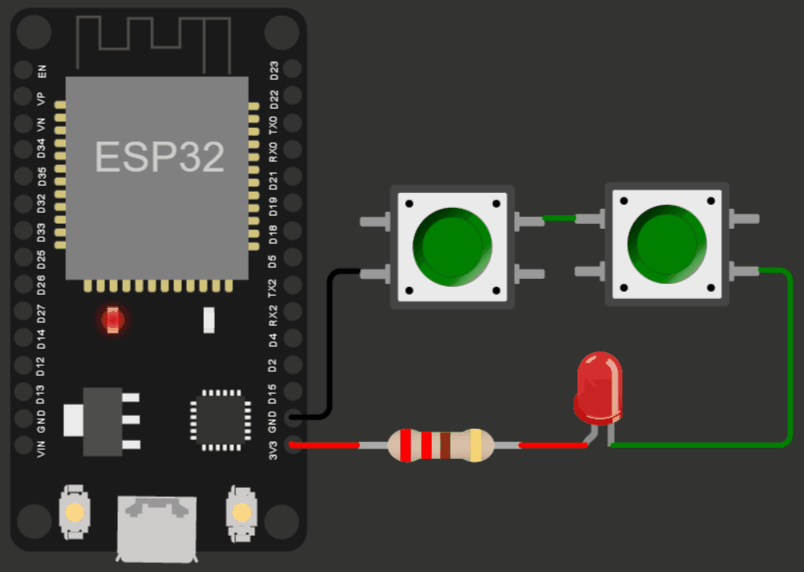

# Lógica E com botões

A lógica E é um dos conceitos fundamentais da eletrônica. Ela é uma operação lógica que produz um resultado verdadeiro se todas as entradas forem verdadeiras.

Em eletrônica, a lógica E é frequentemente utilizada em circuitos com botões. Quando todos os botões são pressionados, o circuito é fechado e a corrente elétrica flui, produzindo um resultado verdadeiro. Se algum dos botões não é pressionado, o circuito permanece aberto e o resultado é falso.

Os circuitos com lógica E são amplamente utilizados em sistemas de controle, automação e eletrônica de consumo. Eles permitem que os usuários controlem dispositivos com facilidade e precisão, tornando a vida mais conveniente e eficiente.

Essa lógica pode ser utilizada em muitas situações do dia a dia. Por exemplo, em sistemas de catracas de acesso a locais restritos, pode-se utilizar um circuito com lógica E para detectar se o usuário possui autorização para acessar o local. Se todas as entradas do circuito estiverem verdadeiras, a catraca será liberada para permitir o acesso.

Da mesma forma, a lógica E pode ser utilizada em sistemas de controle de produção industrial. Sensores de presença e movimento podem ser conectados em circuitos com lógica E para detectar se todos os componentes estão no local correto antes de iniciar o processo de produção. Caso algum componente esteja faltando, o processo não será iniciado, evitando desperdício de materiais e garantindo a qualidade do produto final.

# Circuito com botões e LED

1. Conecte um resistor de 220 ohms à fonte de alimentação, nesse caso, o pino de 3,3V do ESP
2. Conecte a perna positiva do LED (ânodo) ao resistor.
3. Conecte a perna negativa do LED (cátodo) na entrada do primeiro botão.
4. Conecte a saída do primeiro botão na entrada do segundo botão.
5. Conecte a saída do segundo botão à contexão de terra (GND)

Quando todos os botões forem pressionados, a corrente elétrica fluirá através do circuito, acendendo o LED. Se algum dos botões não for pressionado, o circuito permanecerá aberto e o LED permanecerá apagado.

    </img>
    </img>

[Clique aqui para abrir a simulação](https://wokwi.com/projects/358939446507045889)

[Leia mais](https://wiki.ifsc.edu.br/mediawiki/index.php/AULA_3_-_Eletr%C3%B4nica_Digital_1_-_Gradua%C3%A7%C3%A3o#Porta_E)
