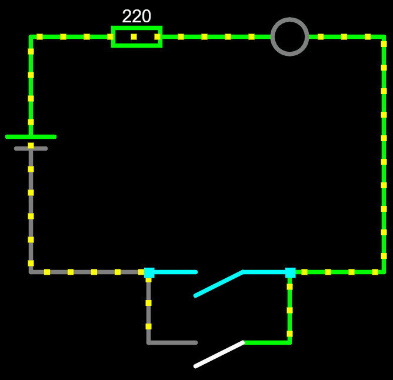
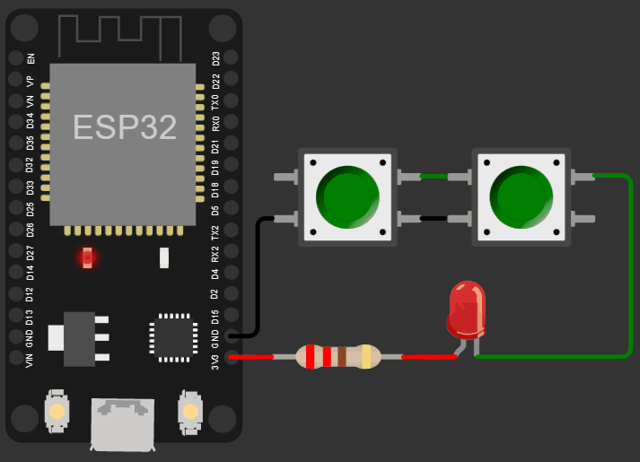

# Lógica OU com botões

A lógica OU é um dos conceitos fundamentais da eletrônica. Ela é uma operação lógica que produz um resultado verdadeiro se pelo menos uma das entradas for verdadeira.

Em eletrônica, a lógica OU é frequentemente utilizada em circuitos com botões. Quando um dos botões é pressionado, o circuito é fechado e a corrente elétrica flui, produzindo um resultado verdadeiro. Se nenhum botão é pressionado, o circuito permanece aberto e o resultado é falso.

Os circuitos com lógica OU são amplamente utilizados em sistemas de controle, automação e eletrônica de consumo. Eles permitem que os usuários controlem dispositivos com facilidade e precisão, tornando a vida mais conveniente e eficiente.

Além disso, a lógica OU é uma das bases para a construção de circuitos mais complexos, como a lógica AND e a lógica NOT. Combinando essas operações, é possível criar circuitos que realizam operações matemáticas, armazenam informações e executam outras funções avançadas.

Essa lógica pode ser utilizada em muitas situações do dia a dia. Por exemplo, em um sistema de alarme residencial, podemos utilizar um circuito com lógica OU para detectar se uma porta ou janela está aberta. Se a porta ou janela estiver aberta, o circuito produzirá um resultado verdadeiro e o alarme será acionado. Da mesma forma, podemos utilizar a lógica OU em um sistema de irrigação para detectar se há água suficiente no solo. Se um dos sensores indicar que o solo está úmido, o sistema não irá irrigar a planta.

# Circuito com botões e LED

1. Conecte um resistor de 220 ohms à fonte de alimentação, nesse caso, o pino de 3,3V do ESP
2. Conecte a perna positiva do LED (ânodo) ao resistor.
3. Conecte a perna negativa do LED (cátodo) nas entradas dos botões.
4. Conecte as saídas dos dois botões à contexão de terra (GND)

Quando um dos botões for pressionado, a corrente elétrica fluirá através do circuito, acendendo o LED. Se nenhum dos botões for pressionado, o circuito permanecerá aberto e o LED permanecerá apagado.

    </img>
    </img>

[Clique aqui para abrir a simulação](https://wokwi.com/projects/358939428219878401)

[Leia mais](https://wiki.ifsc.edu.br/mediawiki/index.php/AULA_3_-_Eletr%C3%B4nica_Digital_1_-_Gradua%C3%A7%C3%A3o#Porta_OU)
