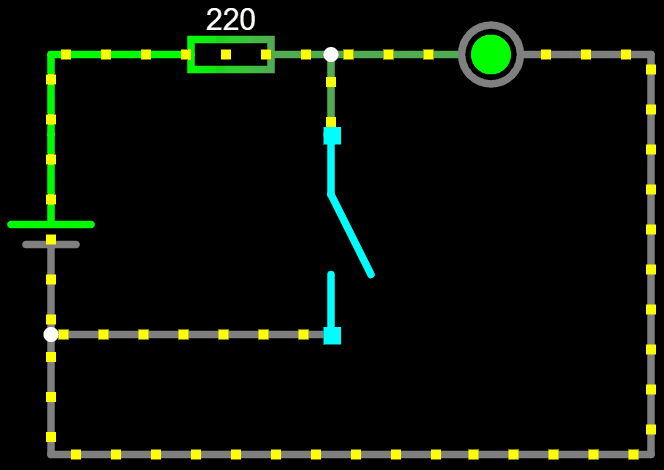
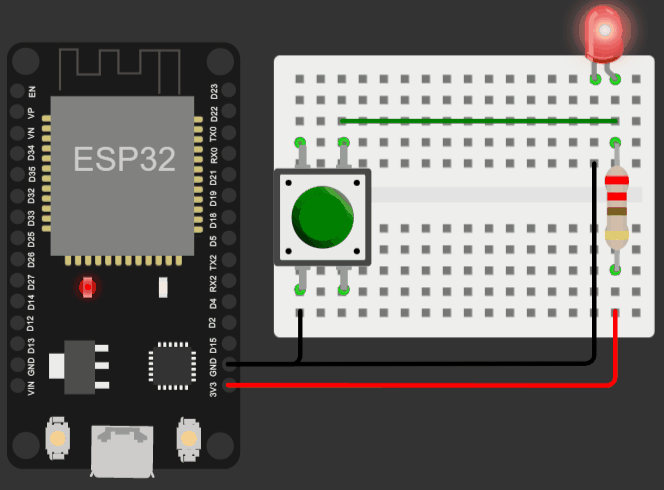

# Lógica NÂO com botões

A lógica NÃO (ou em inglês, NOT) é outro conceito fundamental da eletrônica. Ela é uma operação lógica que produz um resultado verdadeiro se a entrada for falsa, e um resultado falso se a entrada for verdadeira.

Em eletrônica, a porta NÃO pode ser utilizada em muitos circuitos, inclusive com botões. A aplicação dela consiste em desviar a corrente pelo botão, explorando a propriedade da corrente que sempre busca o caminho com a menor resistência, fazendo com que o resto do circuito não seja energizado.

# Circuito com botão de LED

1. Conecte um resistor de 220 ohms à fonte de alimentação, nesse caso, o pino de 3,3V do ESP
2. Conecte a perna positiva do LED (ânodo) ao resistor.
3. Conecte a perna negativa do LED (cátodo) à conexão de terra (GND).
4. Adicione um botão que desvia a corrente da saída do resistor direto para a conexão de terra (GND)

    </img>
    </img>

[Clique aqui para abrir a simulação](https://wokwi.com/projects/358940131730503681)

[Leia mais](https://wiki.ifsc.edu.br/mediawiki/index.php/AULA_3_-_Eletr%C3%B4nica_Digital_1_-_Gradua%C3%A7%C3%A3o#Porta_INVERSORA)
